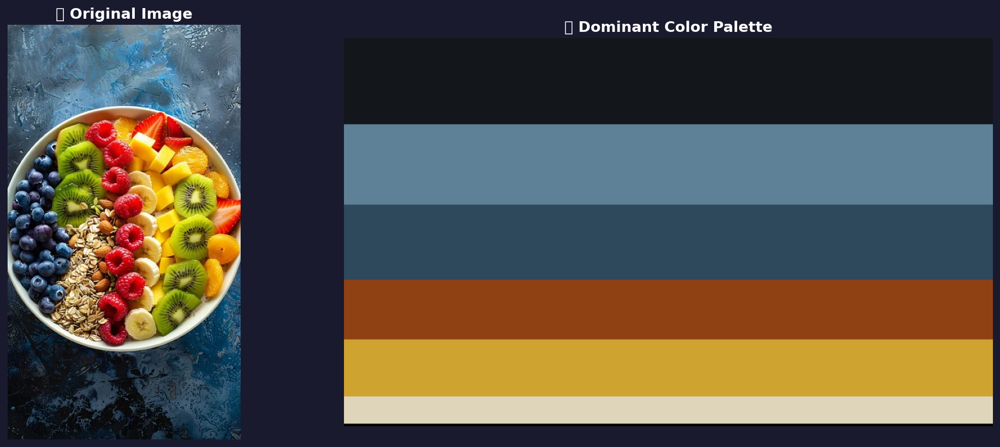

# 🎨 Color Detection – Identify Colors in Images


> A Python-based image color detection system that identifies dominant colors in any image using **K-Means Clustering**, maps them to human-readable color names, and visualizes a beautiful color palette.

---

## 📸 Demo Output

| Original Image | Dominant Color Palette |
|:-:|:-:|
|  | |

### 🎯 Detected Colors from Sample Image

| Rank | Color Name | R | G | B | HEX | % Share |
|------|------------|---|---|---|-----|---------|
| 1 | Licorice | 19 | 23 | 27 | #13171B | 22.40% |
| 2 | Slate Gray | 94 | 129 | 151 | #5E8197 | 20.67% |
| 3 | Dark Slate Gray | 46 | 72 | 92 | #2E485C | 19.47% |
| 4 | Saddle Brown | 144 | 65 | 20 | #904114 | 15.43% |
| 5 | Satin Sheen Gold | 206 | 163 | 48 | #CEA330 | 14.92% |
| 6 | Bone | 223 | 213 | 187 | #DFD5BB | 7.11% |

---

## ✨ Features

- 📤 **Upload any image** directly in Google Colab
- 🔍 **Dominant color detection** using K-Means Clustering (OpenCV)
- 🏷️ **Color name mapping** via RGB distance matching against a color database
- 🎨 **Visual palette generation** showing colors by percentage area
- 📍 **Single pixel color detection** — click any point to get its color name
- 📊 **CSV export** of all detected colors with RGB, HEX, and percentage values
- 💾 **Auto-download** of results (palette image + CSV)

---

## 🛠️ Technologies Used

| Library | Purpose |
|---------|---------|
| `OpenCV (cv2)` | Image processing & K-Means clustering |
| `NumPy` | Array operations on pixel data |
| `Pandas` | Color database management & CSV export |
| `Matplotlib` | Visualization of color palette |
| `Pillow (PIL)` | Image handling |
| `Google Colab` | Cloud-based notebook environment |

---

## 📁 Project Structure

```
color-detection-python/
│
├── Color_Detection.ipynb       # Main Google Colab notebook
├── colors.csv                  # Color name database (RGB + HEX mappings)
├── detected_colors.csv         # Output: detected colors from sample image
├── color_palette_output.png    # Output: color palette visualization
└── README.md                   # Project documentation
```

---

## 🚀 How to Run

### Option 1 — Google Colab (Recommended)

1. Open [Google Colab](https://colab.research.google.com/)
2. Upload `Color_Detection.ipynb`
3. Run all cells from top to bottom
4. Upload any image when prompted
5. View the color palette and download results!

### Option 2 — Local Setup

```bash
# Clone the repository
git clone https://github.com/YOUR_USERNAME/color-detection-python.git
cd color-detection-python

# Install dependencies
pip install opencv-python pandas matplotlib Pillow

# Run the notebook
jupyter notebook Color_Detection.ipynb
```

---

## ⚙️ How It Works

```
Upload Image
     │
     ▼
Convert to RGB
     │
     ▼
Reshape pixels → (N × 3) array
     │
     ▼
K-Means Clustering (k=6 colors)
     │
     ▼
For each cluster center (R, G, B):
  → Calculate distance to all colors in database
  → Pick closest match → Color Name
     │
     ▼
Sort by pixel count → Percentage
     │
     ▼
Visualize Palette + Export CSV
```

---

## 📦 Dependencies

Install all required libraries with:

```bash
pip install opencv-python-headless pandas matplotlib webcolors Pillow
```

---

## 📊 Sample Output (CSV)

```
Color Name,R,G,B,HEX,Percentage
Licorice,19,23,27,#13171B,22.4
Slate Gray,94,129,151,#5E8197,20.67
Dark Slate Gray,46,72,92,#2E485C,19.47
Saddle Brown,144,65,20,#904114,15.43
Satin Sheen Gold,206,163,48,#CEA330,14.92
Bone,223,213,187,#DFD5BB,7.11
```

---

## 🎓 About

This project was developed as part of the **Codec Technologies Internship Program**.

- 👩‍💻 **Developer:** [Your Name]
- 🏢 **Organization:** Codec Technologies
- 📅 **Year:** 2025

---

## 📄 License

This project is open-source and available under the [MIT License](LICENSE).

---

## 🌟 Show Your Support

If you found this project helpful, please ⭐ **star this repository**!

[](https://github.com/YOUR_USERNAME/color-detection-python)
